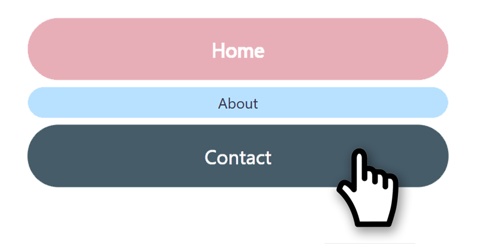

  
 

  
  

React/Nextjs component to for setting up menu with links to pages.

## Installation:
`npm i @lucyderojas/menu13`

## Import:

`import Menu from '@lucyderojas/menu13/dist/Menu';`

## Use with default values:
`<Menu />`
 

 

## Available arguments:
<!-- pages, width, cornerRadius, align, backgroundBasic, colorBasic, backgroundHover, colorHover, backgroundSelected, colorSelected -->

>`<Menu `  
>>`pages = {['page1', 'page2', ...]}`  
`width= '50%' || '600px'`  
`cornerRadius  = '50%' || '600px''`   
`align  = 'left' || 'center' || 'right'`   
`backgroundBasic  = 'red' || 'rgb(1,2,3)' || 'hls(1,2,3)'`   

### colors:

# Github:
https://github.com/Lucy-de-Rojas/Menu13

